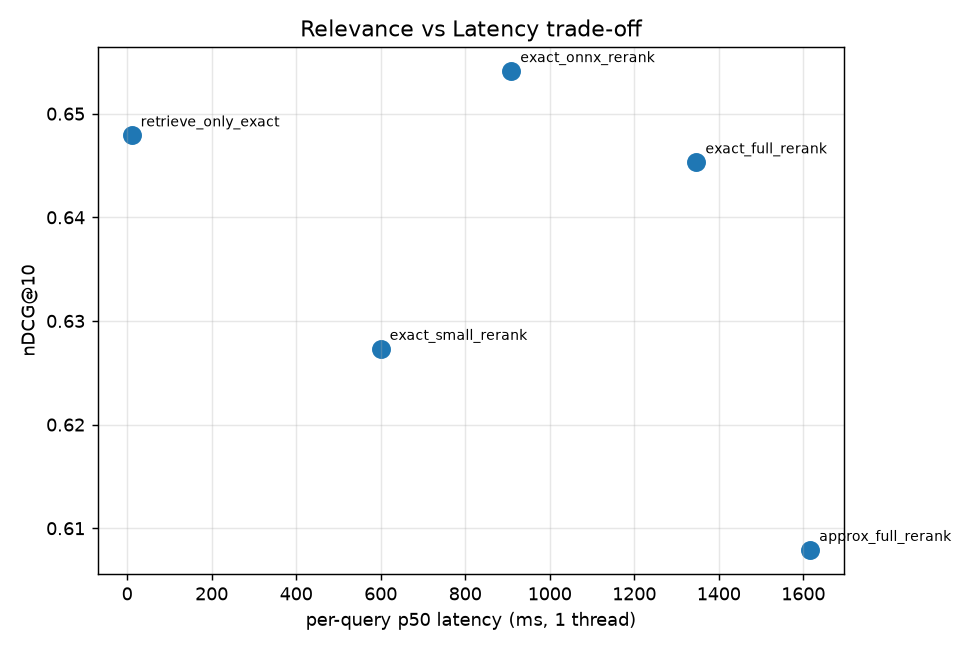
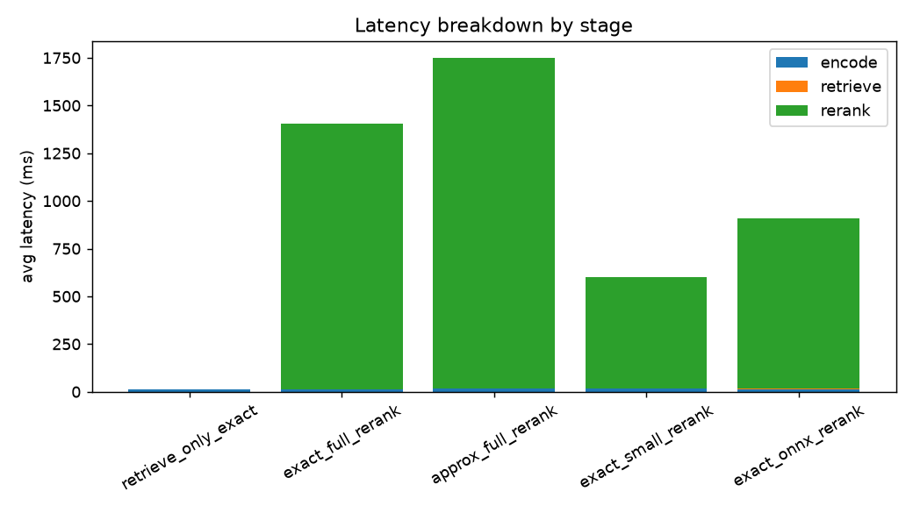
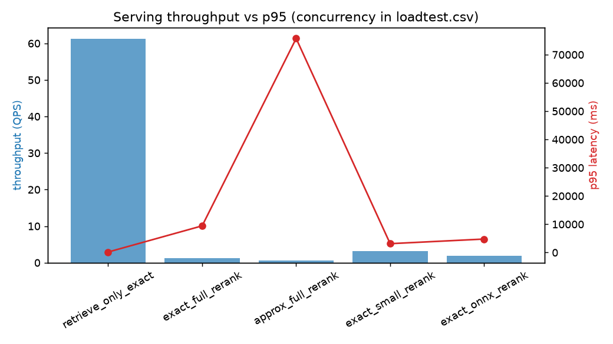

# Inference Serving Benchmark — Retrieval + Reranking

> Build a retrieval + reranking knowledge-search stack, then **measure** which
> serving strategy to ship on a `relevance vs latency vs cost` benchmark — instead
> of assuming the fancy reranker is worth it. Spoiler: on this workload it mostly isn't.

## Problem

A support / FAQ / internal help-center search: a user asks a question, a retriever
picks candidates, a reranker reorders them. Every extra stage adds latency and CPU
cost. The engineering question is not "can we add a cross-encoder reranker" — it is
"**does the reranker earn its latency and cost**, and which serving variant is the
right trade-off?"

- **Use case:** knowledge search — dense retrieval + cross-encoder reranking.
- **Dataset:** [BEIR SciFact](https://huggingface.co/datasets/BeIR/scifact) — 5,183
  documents, 300 test queries, 339 relevance judgements (qrels). Small and labelled,
  so we can report **recall@k / nDCG@10 / MRR** honestly.
- **Users:** ML platform / inference / backend engineers who own serving cost and latency.

## Approach

```
                    query
                      │
              ┌───────▼────────┐   bi-encoder  (all-MiniLM-L6-v2, 384-dim)
              │  retrieval     │   exact  (brute-force cosine)
              │                │   approx (numpy IVF / k-means)   ← ANN, no C-ext
              └───────┬────────┘
                 top-50 candidates
                      │
              ┌───────▼────────┐   cross-encoder reranker
              │  rerank        │   full  (ms-marco-MiniLM-L-6)
              │  (optional)    │   small (ms-marco-MiniLM-L-2)
              │                │   onnx  (L-6 dynamic int8)  ← reuses project 05
              └───────┬────────┘
                 top-10 results
                      │
     ┌────────────────┴─────────────────┐
     ▼                                   ▼
 offline benchmark                  FastAPI service
 relevance / latency / cost         + async load test (QPS, p95, errors)
```

Every variant is measured on the SAME queries; torch/ORT pinned to a fixed 4 threads
so latency is stable and comparable (a server frame, unlike the on-device single-thread
frame of project 05).

## What is measured

| Axis | Metric |
|---|---|
| Relevance | recall@1/10, nDCG@10, MRR@10 (from qrels) |
| Latency | per-query p50 / p95 (ms) + encode / retrieve / rerank breakdown |
| Cost | CPU-ms per query (compute proxy → serving cost) |
| Serving | throughput (QPS), p95 under concurrency, error rate (load test) |

## Results — offline (relevance vs latency vs cost)

SciFact test set, 300 queries, 4 threads, rerank depth 50.

| variant | nDCG@10 | recall@10 | recall@1 | p50 ms | p95 ms | rerank ms | cpu-ms/query |
| --- | --- | --- | --- | --- | --- | --- | --- |
| retrieve_only_exact | 0.6479 | 0.7900 | 0.4846 | **10.7** | 13.5 | 0.0 | 47 |
| exact_full_rerank | 0.6453 | 0.7954 | 0.4848 | 1347 | 1681 | 1391 | 5653 |
| approx_full_rerank | 0.6079 | 0.7397 | 0.4698 | 1616 | 1990 | 1732 | 6768 |
| exact_small_rerank | 0.6273 | 0.7772 | 0.4723 | 600 | 691 | 586 | 2479 |
| **exact_onnx_rerank** | **0.6541** | 0.7987 | **0.5015** | 909 | 1036 | 896 | 4328 |



*`retrieve_only_exact` (bottom-left) reaches almost the same nDCG@10 as the best reranked
variant at ~85× lower latency.*

<p align="center">
  
</p>

**Recommendation:**
- **Cost/latency pick: `retrieve_only_exact`** — nDCG@10 0.648 at **10.7 ms**, ~85×
  faster than any reranked variant, within 0.02 nDCG of the best. For most support-search
  UX this is the right call.
- **Quality pick: `exact_onnx_rerank`** — the best reranker on every axis (nDCG 0.654,
  1.5× faster and 4× smaller than the fp32 reranker). Worth it **only** if precision@1
  matters: it lifts recall@1 from 0.485 → 0.502.

### The headline finding: measure before you serve

- **Reranking barely pays off here.** The MiniLM bi-encoder already reaches nDCG@10 0.648
  in 10.7 ms. A full cross-encoder rerank *lowers* nDCG to 0.645 for **126× the latency**;
  the best reranker adds only +0.006 nDCG for ~85× the latency. The honest production call
  on this workload is to **drop the reranker** unless top-1 precision is critical.
- **The bottleneck is the reranker, not retrieval.** Retrieval is ~0.5 ms of a ~1350 ms
  request. So **approximate ANN retrieval is pointless here** — `approx_full_rerank` is no
  faster (rerank dominates) and *hurts* relevance (nDCG 0.648 → 0.608 from IVF recall loss).
  Same lesson as project 05: optimize the real bottleneck, not the cheap stage.
- **ONNX int8 is the right reranker optimization** — it attacks the actual hotspot
  (the cross-encoder), giving the best relevance at 1.5× the speed and 1/4 the size of
  the fp32 reranker.

## Results — serving under load

FastAPI service, closed-loop async load test, concurrency 8, 120 requests/variant.

| variant | QPS | p50 ms | p95 ms | p99 ms | error rate |
| --- | --- | --- | --- | --- | --- |
| **retrieve_only_exact** | **61.2** | 128 | 179 | 236 | 0.0% |
| exact_full_rerank | 1.2 | 6194 | 9435 | 11328 | 0.0% |
| approx_full_rerank | 0.6 | 8148 | 75729 | 78564 | 6.7% |
| exact_small_rerank | 3.1 | 2674 | 3133 | 3244 | 0.0% |
| exact_onnx_rerank | 1.9 | 4163 | 4766 | 4958 | 0.0% |



Under concurrency the gap widens: retrieve-only sustains **61 QPS at <200 ms p95**, while every
reranked variant is CPU-bound and collapses to 0.6–3.1 QPS with multi-second p95 (the 4-thread
reranker is oversubscribed by 8 concurrent requests → queuing). Among rerankers, **ONNX int8
gives ~1.6× the throughput of fp32** (1.9 vs 1.2 QPS). The **approximate variant is the worst
under load** — 0.6 QPS, a 75 s p95 tail and 6.7% timeouts — most likely thread/BLAS
oversubscription from the numpy IVF path stacking on the torch threads; it loses on relevance,
latency *and* stability, so it is firmly rejected.

## Honest notes / caveats

- **Domain mismatch is part of the story.** The ms-marco cross-encoder is trained on web
  passages; SciFact is scientific claims. Part of "reranking doesn't help" is that mismatch
  — which is exactly the kind of thing a serving benchmark is supposed to *catch* before you
  pay for it in production.
- **CPU-ms/query is a compute-cost proxy** (sum of CPU time across threads), not a billed
  dollar figure — labelled as such.
- **Small corpus (5.2k docs):** exact retrieval is already sub-millisecond, which is *why*
  ANN shows no win. On a 10M-doc corpus the retrieval/ANN trade-off would flip — noted as
  scale-dependent rather than universal.

## Repro

```bash
py -3.11 -m venv .venv
.venv/Scripts/python -m pip install -r requirements.txt

.venv/Scripts/python prepare_data.py                       # BEIR SciFact -> jsonl
.venv/Scripts/python build_index.py                        # encode corpus (dense index)
.venv/Scripts/python optimization/export_reranker.py       # ONNX fp32 + int8 reranker
.venv/Scripts/python benchmarks/offline_bench.py           # relevance/latency/cost table
.venv/Scripts/python benchmarks/serve_and_loadtest.py --concurrency 8 --requests 120
```

## Try it

After `prepare_data.py`, `build_index.py` (and `export_reranker.py` for the onnx variant),
run a live query through the pipeline:

```bash
.venv/Scripts/python demo_search.py --variant exact_onnx_rerank \
  "does vitamin D deficiency increase risk of cardiovascular disease?"
```

```
variant : exact_onnx_rerank
latency : 1276.1 ms  (encode 133.9 | retrieve 3.2 | rerank 1138.9)

  1. [30720103] Vitamin D status: measurement, interpretation, and clinical application...
  2. [12810152] Folate and vitamin B6 from diet and supplements in relation to risk of ...
  3. [16252863] Preventing coronary heart disease: B vitamins and homocysteine...
```

The breakdown makes the whole project's point in one line: the reranker is ~1.1 s of a
~1.3 s request; retrieval is 3 ms. Swap `--variant retrieve_only_exact` to serve the same
top results in ~10 ms.

## Business impact

- **~85× cheaper serving for ~equal relevance** — dropping the reranker on this workload
  cuts p50 from ~900–1350 ms to ~11 ms and CPU cost per query ~100×, with no meaningful
  nDCG loss. That is a direct infra-cost and latency win.
- **A decision rule, not a guess** — the benchmark says exactly when the reranker is worth
  it (top-1 precision) and when it isn't, so the team ships the right stack deliberately.
- **Reusable optimization** — the ONNX int8 reranker (from the project-05 playbook) is the
  right lever *if* reranking is kept.

## What this proves about me

- I treat inference as a **system** and benchmark serving strategies instead of assuming.
- I find the **real bottleneck** (reranker, not retrieval) and reject optimizations that
  target the wrong stage (ANN here).
- I translate serving trade-offs into **cost and latency** decisions a team can act on.
- I carry model-optimization skill (ONNX int8) across projects and apply it where it pays.

### CV bullets

- Built a reproducible retrieval + reranking serving benchmark (BEIR SciFact) measuring
  relevance (nDCG/recall/MRR) against latency, CPU-cost proxy, and throughput under load
  across five serving variants.
- Showed cross-encoder reranking added ≤0.006 nDCG@10 for ~85–126× the latency on this
  workload, and recommended a retrieve-only stack (~11 ms p50) — an ~85× serving-cost cut.
- Identified the reranker (not retrieval) as the bottleneck and demonstrated that
  approximate ANN retrieval was both useless and quality-reducing at this corpus scale.
- Optimized the reranker hotspot with an ONNX dynamic-int8 cross-encoder (1.5× faster,
  4× smaller, best relevance among rerankers), reusing the project-05 optimization playbook.

### Interview talking points

- Why "add a reranker" is a hypothesis to test, not a default — and how the benchmark falsified it here.
- Why approximate retrieval was pointless at 5k docs (retrieval = 0.5 ms of 1350 ms) and when it would flip.
- How ONNX dynamic int8 gives the best reranker on every axis at once.
- How to build honest ranking metrics (recall@k / nDCG / MRR) without heavyweight deps, and a defensible CPU-cost proxy.
